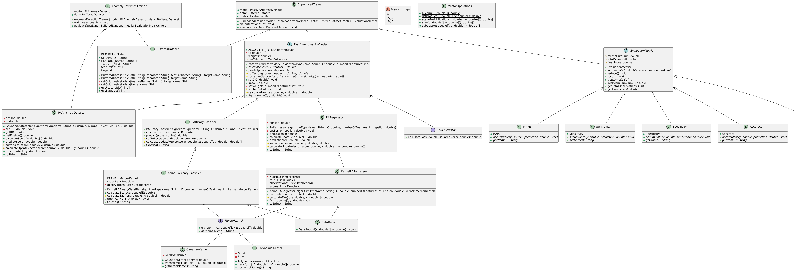
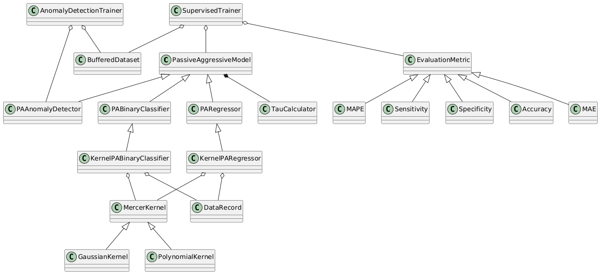

## pal4j: Passive-Aggressive Learning algorithms for Java

---

This project is inspired by the work of Shalev-Shwartz et al. (2003) and, in particular, Crammer et al. (2006). From the various algorithms presented in Crammer et al. (2006), I’ve chosen to implement only a subset:

* **Binary classifier**, in both linear and non-linear forms. While the authors don’t provide full details for the kernelized (non-linear) version, insights from related models like SVMs can be applied effectively.
* **Regressor**, also available in linear and non-linear variants.
* **Anomaly detector**. The original paper discusses the broader problem of uniclass prediction; I’ve adapted this slightly to suit anomaly detection. Only the linear version has been implemented so far.

This library has no external dependencies, which meant building several support components from scratch to ensure everything functions correctly:

* A dedicated **dataset** class designed for online learning.
* A **trainer** class to simplify the training process.
* Custom **performance metrics** (e.g., accuracy, MAE).
* Core **vector operations** (e.g., norms, dot products).
* ...and a few other utilities.

Some basic tests have been written, though I recognize that more are needed to improve the robustness of the library.

The following diagrams can give a complete picture of the structure of the library:

### Class diagram


### Class relations


---

### Getting started

A Maven package is not available yet. To use the library, clone the repo and compile it manually.

#### Sample Usage
```java
import pal4j.core.PABinaryClassifier;
import pal4j.core.SupervisedTrainer;
import pal4j.datautils.BufferedDataset;
import pal4j.datautils.Accuracy;

var features = new String[] {"x1", "x2"};
var target = "y";
var delimiter = ",";

var trainData= new BufferedDataset(
        "train_data.csv",
        delimiter,
        features,
        target

);
var testData= new BufferedDataset(
        "test_data.csv",
        delimiter,
        features,
        target

);

var C = 0.1;
var model = new PABinaryClassifier("PA_1", C, features.length);

var metric = new Accuracy();
var trainer = new SupervisedTrainer(model, trainData, metric);

trainer.train(null); // use the full dataset
trainer.evaluate(testData);
```

### Performance

The Passive-Aggressive models in this package have been evaluated across a range of tasks using several publicly available datasets.

**Binary Classification:**

* [Phishing](https://archive.ics.uci.edu/dataset/967/phiusiil+phishing+url+dataset) (detecting malicious URLs)
* [Breast Cancer](https://archive.ics.uci.edu/dataset/15/breast+cancer+wisconsin+original)
* [Occupancy Detection](https://archive.ics.uci.edu/dataset/357/occupancy+detection) 
* [Stanford Sentiment Treebank (SST-2)](https://huggingface.co/datasets/stanfordnlp/sst2) (binary sentiment classification of text)

**Regression / Time Series:**

* [Electricity Demand](https://www.kaggle.com/datasets/aramacus/electricity-demand-in-victoria-australia?select=complete_dataset.csv)
* [Seoul Bike Sharing Demand](https://archive.ics.uci.edu/datasets?search=Seoul%20Bike%20Sharing%20Demand)

**Anomaly Detection:**

* [Credit Card Fraud Detection](https://github.com/GuansongPang/ADRepository-Anomaly-detection-datasets/blob/main/numerical%20data/DevNet%20datasets/creditcardfraud_normalised.tar.xz)
* [Phishing (repurposed)](https://archive.ics.uci.edu/dataset/967/phiusiil+phishing+url+dataset) – Treated as an anomaly detection problem in this case

The datasets themselves are not included in this repository, but scripts are provided to help you preprocess them.

While the current benchmarks demonstrate the applicability of Passive-Aggressive models to classification, regression, and anomaly detection tasks, 
their full potential—particularly in true streaming contexts—has not yet been fully explored. 


---
### References

Shalev-Shwartz, S., Crammer, K., Dekel, O., & Singer, Y. (2003). Online passive-aggressive algorithms. *Advances in neural information processing systems*, 16.

Crammer, K., Dekel, O., Keshet, J., Shalev-Shwartz, S., & Singer, Y. (2006). Online passive-aggressive algorithms. *Journal of Machine Learning Research*, 7(Mar), 551-585.

---

Proudly developed without the aid of generative AI tools.